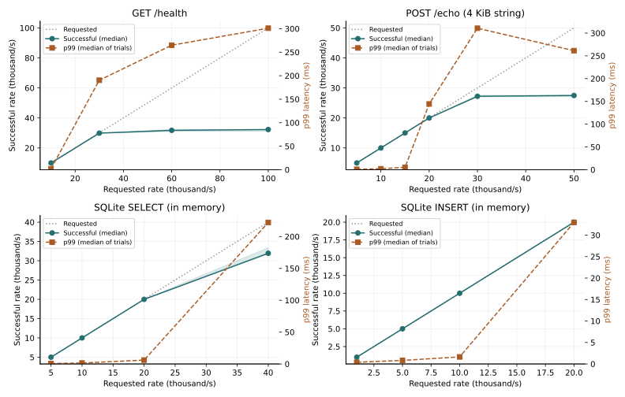
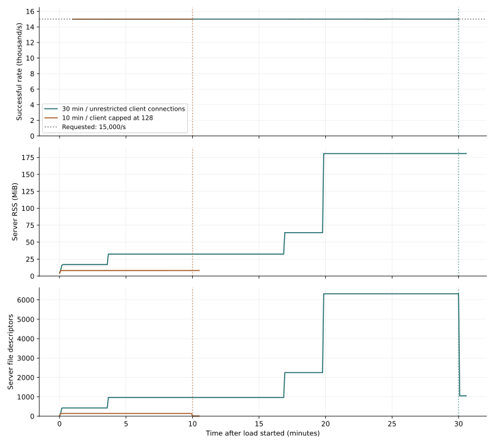
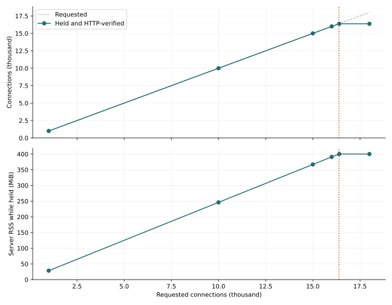

# HTTP load tests

We measured throughput, latency, memory, and connection recovery using Nagi's HTTP sample. The test date was October 1, 2026. The measured implementation was Nagi 0.1.2 at commit [`c602abb`](https://github.com/disnana/Nagi/commit/c602abb349641cf1d5a274e2221e33d29a0acea4).

The endpoint that receives a 4 KiB string and returns JSON handled 15,000 requests per second for 30 minutes. All 27,000,270 requests returned HTTP 200. However, connection counts and memory increased, and file descriptors remained after the load stopped. Throughput alone does not establish stability.

All traffic stayed on the same machine. These results do not establish internet throughput, DDoS resistance, or stability over 24 hours or longer.

## Reading the numbers

- **Requested rate**: the number of requests per second requested from the load generator.
- **Dispatched rate**: the rate the client actually sent. It can fall below the requested rate when the client is overloaded.
- **Successful rate**: successful requests per second, including the final response wait.
- **p99**: 99% of dispatched requests finished within this time. It excludes waiting for arrivals that the client could not send.
- **RSS**: the server's resident memory. File descriptors (FDs) are OS resources used for connections and other handles.

## Increasing the load

| Workload | Requested/s | Dispatched/s | Successful/s | p99 | Errors (3 trials) |
| --- | ---: | ---: | ---: | ---: | ---: |
| HTTP /health | 10,000 | 10,000 | 10,000 | 2.03ms | 0 |
| HTTP /health | 30,000 | 29,960 | 29,874 | 190.36ms | 0 |
| HTTP /health | 60,000 | 31,990 | 31,739 | 264.83ms | 0 |
| HTTP /health | 100,000 | 32,501 | 32,266 | 301.05ms | 0 |
| 4KiB JSON | 5,000 | 5,000 | 4,999 | 0.83ms | 0 |
| 4KiB JSON | 10,000 | 10,000 | 10,000 | 2.12ms | 0 |
| 4KiB JSON | 15,000 | 15,000 | 15,000 | 5.24ms | 0 |
| 4KiB JSON | 20,000 | 19,997 | 19,993 | 144.35ms | 0 |
| 4KiB JSON | 30,000 | 27,471 | 27,216 | 310.65ms | 0 |
| 4KiB JSON | 50,000 | 27,700 | 27,483 | 261.35ms | 0 |
| SQLite SELECT | 5,000 | 5,000 | 4,999 | 0.64ms | 0 |
| SQLite SELECT | 10,000 | 10,000 | 10,000 | 1.46ms | 0 |
| SQLite SELECT | 20,000 | 19,999 | 19,998 | 6.06ms | 0 |
| SQLite SELECT | 40,000 | 32,174 | 31,939 | 222.11ms | 0 |
| SQLite INSERT | 1,000 | 1,000 | 1,000 | 0.39ms | 0 |
| SQLite INSERT | 5,000 | 4,999 | 4,999 | 0.83ms | 0 |
| SQLite INSERT | 10,000 | 10,000 | 10,000 | 1.64ms | 0 |
| SQLite INSERT | 20,000 | 20,000 | 19,998 | 32.96ms | 0 |

Each row is the median of three 8-second trials. The p99 is the median of each trial's p99, not a pooled percentile. Vegeta's percentiles are approximate aggregates. SQLite used an in-memory database. Reads selected the same row; writes kept inserting rows.



[Open the full-size SVG](../../website/assets/http-capacity/http-rates.svg)

When the load generator exhausted its CPU capacity, a higher requested rate did not produce more traffic. The first consecutive sweep also exhausted client source ports. We retained that [initial sweep](../../benchmarks/results/http-capacity-2026-10-01/client-port-exhaustion/), and the main table uses a repeat with a distinct loopback source address for each trial. All 12,177 failures in the initial sweep were client-side `bind: address already in use` errors.

### Fixed-concurrency saturation test

We also increased connection counts using wrk, which places less overhead on the client. This client sends another request after receiving a response.

| Workload | Connections | Responses/s | p99 | CPU (% of one core) | Errors |
| --- | ---: | ---: | ---: | ---: | ---: |
| HTTP /health | 128 | 77,689 | 2.73ms | 99.7% | 0 |
| HTTP /health | 512 | 70,682 | 69.85ms | 99.2% | 0 |
| HTTP /health | 2,048 | 66,528 | 375.86ms | 97.6% | 0 |
| 4KiB JSON | 128 | 39,022 | 4.75ms | 96.9% | 0 |
| 4KiB JSON | 512 | 39,322 | 70.93ms | 99.1% | 0 |
| 4KiB JSON | 2,048 | 38,344 | 386.19ms | 96.5% | 0 |

Values are medians of three 8-second trials. This closed-loop test excludes the latency of arrivals waiting to be sent. Treat it separately from the paced load test above.

## Receiving traffic for 30 minutes

| Condition | 30 minutes, unrestricted client connections | 10 minutes, client capped at 128 connections |
| --- | ---: | ---: |
| Requested rate | 15,000/s | 15,000/s |
| Requests | 27,000,270 | 9,000,090 |
| Non-200 responses or transport errors | 0 | 0 |
| Overall p99 | 34.11 ms | 11.07 ms |
| Maximum sampled server RSS | 180.74 MiB | 8.29 MiB |
| Maximum sampled server FDs | 6,315 | 138 |
| Observation during 30-second recovery | 1,049 FDs remained | FDs returned to the baseline of 10 |



[Open the full-size SVG](../../website/assets/http-capacity/http-endurance.svg)

Memory increased at the same times as connection counts. The control lasted only 10 minutes, so it does not establish that a fixed connection count stays stable for 30 minutes or longer. We did not capture the types of the remaining FDs in the 30-minute run, and have not established whether connection teardown is faulty. RSS remaining high also does not, by itself, prove a memory leak.

In an additional 2-minute trial requesting 30,000/s, all 3,501,137 requests returned HTTP 200 and FDs reached 6,719. FDs returned to 10 after the load stopped and remained stable during 120 seconds of recovery. That trial records FD types and TCP states, but did not reproduce the remaining FDs from the 30-minute run. Their cause remains unresolved.

After the load stopped, we called `/health` every 0.5 seconds for 30 seconds and confirmed responses. The probe itself can briefly use one FD. The last sample in the 128-connection run shows 11 FDs, while other samples and independent TCP observations confirm recovery to 10.

**128 is the measurement client's connection count. This PR does not add a 128-connection limit to Nagi.** A small global server limit would restrict concurrency for many users or long requests.

## Concurrent connection limits

| Requested connections | Initial HTTP success | Held connections reverified | RSS | FDs after disconnect |
| ---: | ---: | ---: | ---: | ---: |
| 1,000 | 1,000 | 1,000 | 28.49MiB | 10 |
| 10,000 | 10,000 | 10,000 | 246.18MiB | 10 |
| 15,000 | 15,000 | 15,000 | 366.97MiB | 10 |
| 16,000 | 16,000 | 16,000 | 391.07MiB | 10 |
| 16,400 | 16,374 | 16,374 | 400.16MiB | 10 |
| 18,000 | 16,374 | 16,374 | 400.12MiB | 10 |

After the initial response, we sent another HTTP request over every held connection. A successful TCP handshake alone does not count as a working connection.

When we requested 18,000 connections, 16,503 completed a TCP handshake, but only 16,374 returned the initial HTTP response and passed the held-connection verification.



[Open the full-size SVG](../../website/assets/http-capacity/http-connections.svg)

The OS FD limit was 16,384. The server also needs FDs for resources other than connections, so it runs out before this many clients can be accepted. This is an OS-dependent limit, not a fixed Nagi connection limit.

## Idle, incomplete, and abruptly closed connections

| Condition | Observation over 120 seconds |
| --- | --- |
| Connect without sending a request | All 100 remained open |
| Stop while sending HTTP headers | All 100 remained open |
| Stop while sending the HTTP body | All 100 received 408 and closed |
| Leave keep-alive idle after a response | All 100 remained open |
| All clients disconnect normally | FDs returned to 10 during 5-second recovery |
| 200 abrupt disconnects (RST) after partial headers | FDs returned to 10 during 5-second recovery |

We observed 100 connections in each condition concurrently for 120 seconds. This is a small local behavior test, not a distributed attack or an attack on a public service.

### Connection management and DoS protection

The current [`serve`](../../runtime/src/lib.rs) has a 1 MiB HTTP body limit and a 2-second handler timeout. It binds only to `127.0.0.1` by default. These controls do not bound every connection's lifetime or the traffic reaching a public deployment.

Rather than imposing a global limit of 128 connections, the proposed direction is to ensure disconnected clients release their resources and set deadlines for silent or stalled clients. Any policy must preserve valid HTTP requests, streams, and WebSocket sessions.

A candidate for the next PR uses configurable defaults of 10 seconds to complete initial or partial headers and 60 seconds for unused HTTP keep-alive after a response. The initial deadline includes silence immediately after accept. Idle deadlines would not be applied indiscriminately to active responses, streams, or upgraded WebSocket sessions. These are proposed compatibility changes, pending a policy decision before implementation.

| Proposed control | Intended effect | Decision still needed |
| --- | --- | --- |
| Investigate and fix connection teardown | Release resources after disconnects | Reproduce and identify the remaining FDs from the 30-minute run |
| Header receive deadline | Bound silent or partial-header connections | Deadline and treatment of slow legitimate clients |
| HTTP idle deadline | Reclaim unused connections | Configurable deadline and reconnection costs |
| Body receive and work admission controls | Bound stalled uploads and queued work | Interaction with existing timeouts and queue capacity |
| Fronting proxy or CDN | Filter excessive traffic to public services | Deployment, traffic and connection budgets, and source policies |

This PR does not change runtime or deployment limits. If a DDoS attack fills the network link, controls inside Nagi cannot resolve that saturation; upstream protection is also needed.

## Environment and reproduction

| Item | Condition |
| --- | --- |
| Nagi / Rust | 0.1.2 / 1.98.1 |
| OS | Linux x86_64 |
| CPU | AMD EPYC 7763 64-Core Processor |
| CPU allocation | cgroup quota of 4 CPUs; 5 logical CPUs available |
| Memory limit | cgroup 16 GiB |
| Server / generator | CPU 0 / CPUs 2,3 |
| Server FD limit | Soft and hard limits both 16,384 |
| HTTP / SQLite | HTTP/1.1 without TLS / in-memory database |
| Build | release, opt-level=3, LTO disabled |

The server used one logical CPU and one executor worker. The generator used two different logical CPUs. SQLite has a dedicated database worker. OS FD limits were not raised. Every short trial started a fresh server and database, with warmup outside the measured interval.

Use Linux/cgroup v2, Python 3.12, Rust, `taskset`, and [Vegeta v12.13.0](https://github.com/tsenart/vegeta/releases/tag/v12.13.0). The wrk test also needs [wrk 4.2.0](https://github.com/wg/wrk/tree/4.2.0). To reproduce the same language implementation, build `c602abb` and copy this PR's measurement scripts into that checkout.

```sh
cargo build --locked --release -p nagic
NAGI_ROOT="$PWD" NAGI_NATIVE_TARGET_DIR="$PWD/native-target" \
  ./target/release/nagic build examples/crud.nagi --out build/crud

python scripts/http_capacity.py --phase limits --duration 8 --repeats 3 \
  --vegeta /path/to/vegeta --out build/http-limits
python scripts/http_capacity.py --phase soak --soak-seconds 1800 --soak-rate 15000 \
  --vegeta /path/to/vegeta --out build/http-soak
python scripts/http_saturation.py --wrk /path/to/wrk --out build/http-saturation
python scripts/tcp_capacity.py --out build/tcp-capacity
python scripts/http_connection_lifecycle.py --out build/connection-lifecycle
```

Default CPU IDs are `0` for the server and `2,3` for the client. Use `--server-cpus` and `--client-cpus` to choose disjoint available IDs if necessary. The target is fixed to `127.0.0.1:8080`. Existing results are never overwritten.

[Raw data, conditions, and measured script snapshots](../../benchmarks/results/http-capacity-2026-10-01/) are included. Regenerate the figures while retaining the measurements. Plotting needs matplotlib; measurement does not.

```sh
python scripts/http_capacity_report.py \
  --data benchmarks/results/http-capacity-2026-10-01 \
  --assets website/assets/http-capacity
```

TLS, a real network link, sustained writes to persistent SQLite, WebSocket fan-out, and continuous operation over 24 hours or longer remain unmeasured. The [previous measurements](measurements.md) used different clients and CPU allocations, so these numbers are not a direct before-and-after comparison.
