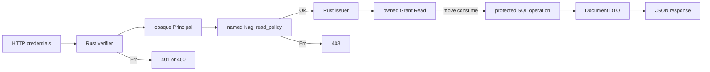

# Typed auth boundary and a custom Nagi policy

[日本語](README.md)

This example uses the experimental `std.auth` API targeted for Nagi 0.1.11. Check the official release record to confirm published availability. Rust/Axum owns HTTP and credential verification, Nagi owns a custom authorization policy, and a trusted Rust adapter issues a sealed grant and reads SQLite. Ordinary classes are DTOs; `Principal` and `Grant[Read]` cannot be constructed, JSON-decoded, cloned, or shared by Nagi.

```sh
nagic run --project test-nagi-code/application-examples/auth-boundary
curl -H 'Authorization: Bearer demo-alice' http://127.0.0.1:8098/documents/1
curl -H 'Authorization: Bearer demo-alice' http://127.0.0.1:8098/documents/2
```

The first request returns Alice's document with 200; the second returns 403. `/health` is public, `/me` requires authentication, and `/documents/{id}` plus `POST /documents/read` require resource authorization. Bob uses `Bearer demo-bob` for document 2. Document 3 is denied by the additional Nagi blocked condition.

Rust `authorize_read` awaits the known named Nagi `read_policy` before issuing `Grant[Read]`. `read_document` consumes that grant and binds its internal subject/resource into SQL, which rechecks owner/blocked conditions. There is no second bare resource ID parameter. Adding `authorized: true` to JSON is rejected by the input DTO.



This is a manual diagram of the sample, not an automatic map or a proof of all response information flow.

Fixed credentials are demo fixtures. This is not JWS signature, expiry, issuer/audience, issuance, or revocation verification. Replace `authenticate` with a reviewed existing Rust verification crate before issuing a production Principal. Policy logic and Rust issuer correctness remain trusted. The compiler does not prove every route protected, prevent every DTO leak, or bind owned proofs to a request lifetime; owned async delegation is allowed.

Both modes use a 4096-byte body limit, 1000-ms extraction/handler deadline, 32 concurrent requests, and a fixed 500 for pre-response unwinding. The listener is loopback HTTP/1 with Ctrl+C shutdown. TLS, HTTP/2, connection admission limits, and independent header/send/shutdown deadlines are absent. Standard HTTP settings are not inherited. Small SQLite queries use a synchronous mutex; this is not a generic pool/transaction API. Cancellation or panic is not rollback.

`NAGI_AUTH_POLICY_MODE=nagi` (default) or `rust` uses the same executable, router, database, and payload. It selects the generated Nagi `load_document` plus Nagi policy, or handwritten Rust with the same Result/await/validation/policy. Rust mode calls no Nagi functions from its handler and connects to the shared Rust verifier/protected DB operation. Both modes reuse the generated DTO and permission marker. This is not a language-wide performance comparison. `smoke.py` exercises both modes over real sockets.
