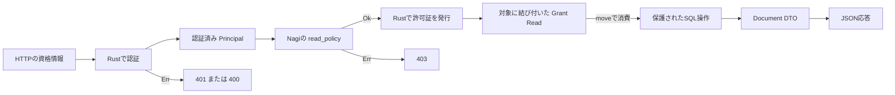

# Authの型境界とNagiの独自policy

[English](README.en.md)

`std.auth`のexperimental APIを使うNagi 0.1.11導入対象の例です。公開配布で利用できるかは公式Release記録を確認してください。Rust/AxumがHTTPとcredential検証、Nagiが独自認可policy、Rust adapterが封印した許可証の発行とSQLite readを担当します。通常classはDTOに使います。`Principal`と`Grant[Read]`は、Nagiからの手動構築・JSON復元・clone・shared化を許さない型です。

```sh
nagic run --project test-nagi-code/application-examples/auth-boundary
curl -H 'Authorization: Bearer demo-alice' http://127.0.0.1:8098/documents/1
curl -H 'Authorization: Bearer demo-alice' http://127.0.0.1:8098/documents/2
```

前者は200とAliceのdocument、後者は403です。`/health`はpublic、`/me`は認証のみ、`/documents/{id}`と`POST /documents/read`はresource単位の認可です。Bobは`Bearer demo-bob`でdocument 2を読めます。document 3はNagiの追加blocked条件で拒否します。

Rustの`authorize_read`が名前付きNagi `read_policy`をawaitし、成功後だけ`Grant[Read]`を作ります。`read_document`はGrantをmoveで消費し、内部のsubject/resourceからSQL bindを作ります。許可証と別のbare IDを渡す引数はありません。SQLもowner/blockedを再確認します。入力に`authorized: true`を足しても型付きJSON入力で拒否します。



図はこのsampleの手書き経路です。自動mapや全response情報流の安全性証明ではありません。

固定credentialはデモfixtureです。JWS署名、期限、issuer/audience、token発行・失効は実装していません。本番では`authenticate`を既存Rust検証crateへ差し替えてからPrincipalを発行します。Nagi policyとRust issuerの正しさはtrusted作者の責任で、compilerはpolicyの論理を証明しません。認可後の通常DTOの全response流出、全routeの保護、request寿命・背景処理へのdelegation制限も保証しません。

本文4096 byte、handler/抽出期限1000 ms、同時処理32、応答前unwindの固定500を両policy modeで揃えます。loopback、HTTP/1、Ctrl+C shutdownです。TLS、HTTP/2、listener接続上限、header/送信/停止の独立期限は追加しません。標準HTTPの設定は継承しません。SQLiteの小さいデモqueryは同期mutex内で実行し、汎用pool・transaction APIではありません。取消/panicはDB rollbackではありません。

`NAGI_AUTH_POLICY_MODE=nagi`（既定）と`rust`は同じ実行ファイル・Router・DB・payloadを使い、Nagi生成`load_document`＋Nagi policyと、手書きRustの同じResult/await/validation/policyを切り替えます。Rust modeのhandlerはNagi関数を呼ばず、共有するRust verifier/保護DB操作へ接続します。両方とも同じ生成DTO/permission markerを使います。言語全体の性能比較ではありません。`smoke.py`は両modeを実socketで確認します。
